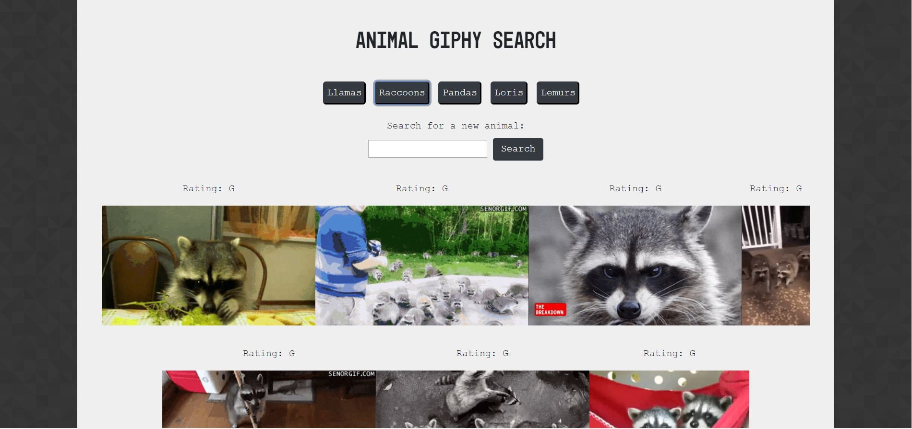

# Animal Giphy Search
> UT Coding Bootcamp Homework 6

## Table of contents
* [General info](#general-info)
* [Screenshots](#screenshots)
* [Technologies](#technologies)
* [Setup](#setup)
* [Features](#features)
* [Status](#status)
* [Contact](#contact)

## General info
Use the GIPHY API to make a dynamic web page that populates with gifs of your choice. Use of JavaScript and/or jQuery to change site HTML.

## Screenshots

## Technologies
* HTML5/CSS3
* JavaScript
* jQuery
* Giphy API

## Setup
Live: https://mgmarti.github.io/giphy/

User clicks on GIF to animate/stop animation

## Features
List of features ready and TODOs for future development
* Preloaded animal buttons
* User can search for preferred animal

## Status
Project is: _finished_ - met assignment requirements.

## Contact
Created by [@mgmarti](https://www.monicamartinez.dev/) - feel free to contact me!
